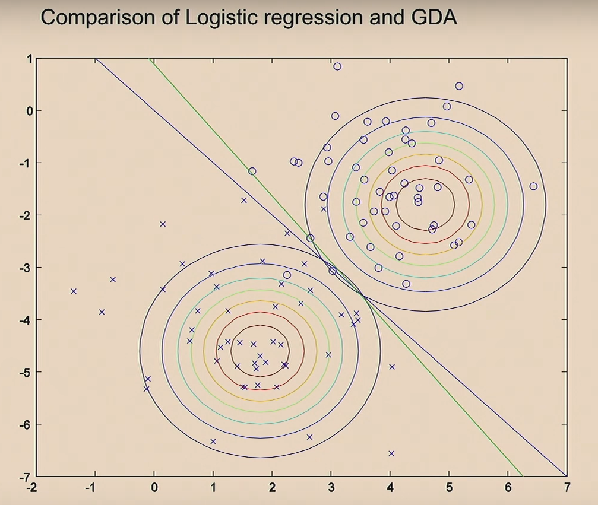

# CS229 - Machine Learning (Fall 2018)
Taught by Andrew Ng ([Link to YouTube](https://www.youtube.com/playlist?list=PLoROMvodv4rMiGQp3WXShtMGgzqpfVfbU))

Lecture notes by Aadi Badola

## Linear Regression
Involves fitting a line (plane, or hyperplane) to your data to make predictions on a **continuous** variable $y$ based on some input features $x_i$.
The output of the learning algorithm is a *hypothesis* $h$ represented as a function of the features.
$$
y=h(x)=\sum_{i=0}^{n}{\theta_i x_i}=\Theta^Tx
$$
where $x_0=1$ and $X$ is a feature matrix of size $n$ and $\Theta$ is a weight matrix of size $n$. An extra constant $x_0$ is added to serve as an *intercept/bias* for the hyperplane, therefore if the `num_features=n` then size of $X$ and $\Theta$ is `n+1`.
The parameters of Linear Regression are the $\theta$ values.
The algorithm works to choose the values of the parameters $\theta$ such that $h(x)\approx y$ for the training examples. That is, minimizing the distances between the predicted and actual values.
$$error=\frac{1}{2}\sum_{i=1}^{m}{(h(x)-y)^2}$$
The `1/2` is added due to convention as it gets cancelled out during derivation.
	
Linear Regression uses **[Gradient Descent](Gradient%20Descent.md)** to minimize the cost function.
However, in the case of Linear Regression, if the same squared error cost function is used, then the plane of the cost function will always be a quadratic function, *i.e.* it will be a paraboloid. This means that the only local minimum is the global optimal value.

In Linear Regression specifically, since the shape of the cost function is always a paraboloid, the global optimum can be obtained in just **one step** by taking the derivative of the matrix $\Theta$ and *setting it to 0*.

Linear Regression is a *Parametric* learning algorithm which involves fitting a set of parameters to data.
## Locally Weighted Regression
*Non-Parametric* learning algorithm - that is the amount of data/parameters you need to keep grows (ex. linearly with the size of your data).

When making predictions, the algorithm attempts to fit a line on only a smaller subset of points taken from the local neighborhood of the point where the prediction has to be made.
That is, fit $\Theta$ to minimize a modified cost function $\sum{w_i\cdot(y_i-\theta^T{x_i})^2}$,
where $w_i$ is a 'weight' function such as $exp(\frac{-(x_i - x)^2}{2\tau^2})$
$x$ is the location where you want to make the prediction and $x_i$ is the input for the $i^{th}$ training example. Therefore if $|x_i - x|$ is small, then $w_i\approx1$ 

For a given point $x$ where a prediction needs to be made, a weight curve resembling a gaussian density function (bell curve) is created around that point and all sample training points $(x_i,y_i)$ are given a weight corresponding to the height of the weight curve at the point $(x_i,w_i)$. This way points closer to $x$ are given a higher weight and points farther away are given a smaller weight.
	The curve fitted is not actually a gaussian probability density function as the the weight function described above does not integrate to 1. It simply resembles a gaussian.
The weight function also contains a hyperparameter $\tau$ which is the *bandwidth* of the gaussian curve. This parameter widens or narrows the curve telling the algorithm how broad of a neighborhood to be affected by when making predictions. 

- This algorithm is not particularly good at extrapolation to predict for values greatly outside the domain of the training examples (but that is also the case for most machine learning algorithms).
- This algorithm *is* useful when the dimensionality of the problem is low (small # of features) and a *relatively* large dataset of examples (?)

For discrete classification problems (especially binary classification), it does not make sense to Linear Regression or LWR to fit a line to your dataset and threshold the values below and above some value (say 0.5). This is because these models are especially sensitive to outliers and the presence of dispersed target values in a problem such as binary classification would greatly skew the line resulting in an inappropriate decision boundary.

## Logistic Regression
One of the most commonly used classification algorithms.
### Algorithm
The algorithm works to output a probability value of the target $y$ given some input features $x$, parameterized by $\theta$. That is,
$$
p(y\ |\ x\ ;\theta ) = h_\theta(x)
$$
For a binary classification problem, the algorithm is designed to fit parameters $\Theta$ to input $x$ such that it outputs values between 0 and 1, that is $h_\theta(x) \in [0,1]$.
	and since $y$ can only take on the values $\{0,1\}$, the formula 
	$p(y\ |\ x\ ;\theta) = h_\theta(x)^y \times (1-h_\theta(y))^{1-y}$
	holds true as the probabilities of both hypotheses must add up to 1 and and depending on which label value is being evaluated, one of the two terms in the equation would evaluate to 1 due to their exponent.

The algorithm is driven by the definition of $h_\theta(x)$ 
$$
= g(\Theta^Tx) = g(z)
= \frac{1}{1+e^{-z}}
$$
This function is commonly known as the "***sigmoid***" or the "***logistic***" function, and outputs values between 0 and 1.

*Why the sigmoid function?*

Logistic Regression uses batch gradient *ascent* as the algorithm is trying to *maximize* the log likelihood of $\Theta$ as compared to Linear Regression which uses gradient *descent* since it attempts to *minimize* the mean squared error.
The log likelihood function is a concave function therefore the *only maximum* is the *global maximum*.

## Simple Perceptron
Typically uses the *binary-step* function
$$
\begin{equation}
g(x)=
	\begin{cases}
	1; z\geq0 \\
	0; x\lt 0
	\end{cases}
\end{equation}
$$
Parameters are updated at each iteration as
$$
\theta_j:=\theta_j + \alpha(y_{i}-h_\theta(x_i))x_{ij}
$$
where $x_i$ is the *set of features* for the $i^{th}$ training example and $x_{ij}$ is the the specific feature at index $j$ for which the corresponding parameter is $\theta_j$
In this case, the error values $(y_i-h_\theta(x_i))$ would take the values $0$ if the model guesses correctly or $\pm1$ on an incorrect guess of 0 or 1.
This algorithm outputs a line (*decision boundary*) of the equation $\Theta^Tx=b$ and can classify points based on which side of the line they fall on. Points above the line would satisfy $\Theta^Tx\gt b$ and points below it would satisfy $\Theta^Tx\lt b$ .

This simple perceptron algorithm is fairly limited when there exists a problem which cannot be properly separated by a linear boundary. (XOR problem)
## Bayes Rule
$$
\begin{equation}
p(y_i|x)= \frac{p(x|y_i)\ p(y_i)}{p(x)}
\end{equation}
$$
and
$$
\begin{equation}
p(x)=\sum_{i=0}^{n}{p(x|y_i)\ p(y_i)}
\end{equation}
$$
where
$p(A|B)$ is the probability of $A$ given that $B$ has occurred.
### Discriminative vs Generative Learning Algorithms
- **Discriminative Learning Algorithms** - Like Perceptron based algorithms, SVMs, or Logistic Regression learn `P(y | x)`. or some mapping `x -> y`.
- **Generative Learning Algorithms** - In contrast, a GLA learns `P(x | y)`. That is, given a value for a specific class, what do the features tend to look like.

If an algorithm is able to learn values for $p(x|y_i)$ and $p(y_i)$ for each class value, then a prediction for a class $y_k$ can be made by substituting all values in equation $(i)$. 

### Gaussian Discriminant Analysis
Suppose features $x$ are continues values,
Assume $p(x|y)$ is a *Gaussian* (normal) distribution.
GDA uses $\mu_0$, $\mu_1$, $\phi$,  and $\Sigma$ as its parameters, where $\mu_i$ is the mean of probability distribution and $\Sigma$ is the covariance matrix and $p(y)=\phi^y \cdot (1-\phi)^{1-y}$.
In generative learning algorithms, the cost function which is maximized is the
	*likelihood of $P(x_i,y_i)$ given some values for the parameters mentioned above*
as opposed to discriminative algorithms where the function being maximized is
	*the likelihood of $P(y_i | x_i)$ for some parameter $\theta$ around which the model regresses*.

In Generative Algorithms like GDA, Gaussians are fit over examples which define the likelihood of classifying a new point. 

In this case, two gaussian distributions are fit to classify two distinct classes based on a two dimensional feature vector. The green line represents the convergence of logistic regression on the same the dataset.
>Choosing different $\mu$ values for each class label and the same $\Sigma$ covariance matrix for all classes typically results in a linear decision boundary.

### Naive Bayes
Assumes that all features $x_i$ are conditionally independent, given $y$.
This means that if you know the label value for a given class, then whether or not each word appears or does not appear is independent of all other words.
$p(y)$ is known as the *Prior Probability*. 
Involves literally just applying bayes rule after evaluating the conditional and prior probabilities across your dataset.
For class labels $y_0, y_1...y_n$ and discrete features $x_0, x_1...x_m$, evaluate the conditional probabilities for all combinations of $p(x_i | y_j)$ and the prior probabilities $p(y_j)$.
Then to make predictions for a vector $\set{x_{i1},x_{i2}, x_{i3}}$:
compute
$$
p(y_j | x_{i1}\ x_{i2}\ x_{i3}) = p(x_{i1}|y_j) \times p(x_{i2}|y_j) \times p(x_{i3}|y_j)
 \times p(y_j)$$
 for all labels in $Y$ and compare the resultant probabilities (*scores*).